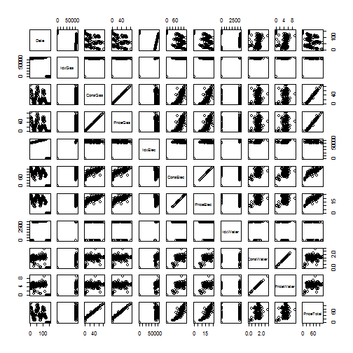

Presentation
========================================================
author: Wenkai Liang  
date: July 2015


Description
========================================================

This app shows the following data:

- gas
- electricity
- water

for the years 2012 to 2014.


Details
========================================================
Excel sheet records the data displayed by the different meters.

Demonstrate the weekly difference.

Further more, a formula is applied to compute an estimate price (expressed in
EUR) for the week's consumption.

Data
========================================================

Here are the first 10 lines of the Excel file (for the columns which interest
me, the ones I show in the barplot):


```
         Date PriceGas PriceElec PriceWater
1  2012-01-01    55.51     22.14       2.96
2  2012-01-08    57.22     23.67       3.30
3  2012-01-15    62.07     23.29       3.26
4  2012-01-22    56.59     23.67       3.02
5  2012-01-29    63.63     23.86       3.12
6  2012-02-05    83.32     24.43       4.61
7  2012-02-12    83.80     25.39       5.03
8  2012-02-19    59.13     23.29       5.62
9  2012-02-26    54.13     21.00       5.40
10 2012-03-04    40.49     21.38       3.66
```
Plot
========================================================
 

It is interesting to write a presentation in RPre!
